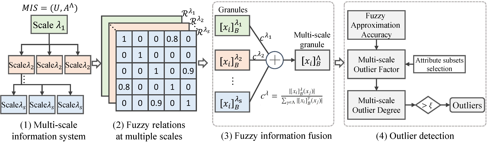

# MFIOD
Baiyang Chen, Yongxiang Li, Dezhong Peng, Hongmei Chen, and Zhong Yuan*, "[Fusing multi-scale fuzzy information to detect outliers](https://www.sciencedirect.com/science/article/pii/S1566253523004499)," ([PDF](2024-MFIOD-PDF.pdf)) Information Fusion, vol. 103, p. 102133, 8 November 2023, DOI: 10.1016/j.inffus.2023.102133


## Abstract
Outlier detection aims to find objects that behave differently from the majority of the data. Existing unsupervised approaches often process data with a single scale, which may not capture the multi-scale nature of the data. In this paper, we propose a novel information fusion model based on multi-scale fuzzy granules and an unsupervised outlier detection algorithm with the fuzzy rough set theory. First, a multi-scale information fusion model is formulated based on fuzzy granules. Then we employ fuzzy approximations to define the outlier factor of multi-scale fuzzy granules centered at each data point. Finally, the outlier score is calculated by aggregating the outlier factors of a set of multi-scale fuzzy granules.

## Framework
<figure style="text-align:center">

<figcaption>MFIOD's overall framework </figcaption>
</figure>

## Environment
* python=3.8
* numpy=1.23
* scikit-learn=1.2

## Usage
To reproduce the results in the paper:
```
python run_reproduce.py
```

To reproduce the examples in the paper:
```
python run_example.py
```
To run MFIOD on customized datastes with default parameters:
```
# Assume the dataset be saved in a Numpy npz file with n samples and m dimensions
# An m dimensional bool vector be given to indicate: True=Nominal attribute, False=Numerical attribute; if not provided, all attributes are treated as numerical.

python run_customs_default_paras.py
```
To run MFIOD on customized datastes with parameter tuning:
```
To be updated later.
```


## Citation
If you find the code or datasets useful in your research, please consider citing:
```
@article{Chen2024MFIOD,
    title = {Fusing multi-scale fuzzy information to detect outliers},
    author = {Baiyang Chen and Yongxiang Li and Dezhong Peng and Hongmei Chen and Zhong Yuan},
    journal = {Information Fusion},
    volume = {103},
    pages = {102133},
    year = {2024},
    issn = {1566-2535},
    doi = {10.1016/j.inffus.2023.102133},
    }
```
or:

Baiyang Chen, Yongxiang Li, Dezhong Peng, Hongmei Chen, and Zhong Yuan, "Fusing multi-scale fuzzy information to detect outliers," Information Fusion, vol. 103, p. 102133, doi: 10.1016/j.inffus.2023.102133

## Contact
If you have any questions, please contact farstars@qq.com
